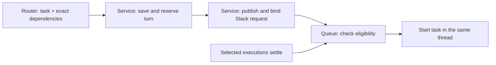

# Wait for existing work

Status: design only, not implemented. Updated 2026-09-10 after Tejas chose the inbox router to interpret the incoming request and resolve its exact dependencies across managed channels. The transport recommendation is structured submission to the running Concierge service, which persists the request before publishing an inert bot-authored Slack message. Bot authorship is an explicit consequence of this recommendation; the sandbox acceptance below remains implementation work.

The established experience is: a request appears immediately in its destination channel, its root carries ⏳ while waiting, and work starts automatically in that same thread. Waiting is opt-in. There is no automatic waiting receipt, progress reply, or “starting now” announcement. The behavior must be available across every Concierge-managed product channel.

## Three different responsibilities

“Concierge” names both a platform and a project channel. Distinguish these responsibilities:

| Component | Responsibility |
| --- | --- |
| Inbox router | Understand human language: which project, new or resumed work, whether to defer, and which existing executions the user means. Submit the request and exact dependency references. |
| Concierge service | Always-running Bun/TypeScript bot code shared by managed channels. It validates submitted identities, persists requests, publishes their Slack messages, applies admission rules, receives provider lifecycle events, and launches eligible work. |
| Destination task agent | Codex or Claude executing the product request with that project's context. It is started only after admission permits it. |

Ordinary code can enforce a wait without understanding English. It checks whether identified executions have settled. The task agent does not need to exist while the request waits. The inbox router performs the one natural-language interpretation; the service validates and enforces its structured submission without a second semantic decision.

The existing queue already enforces one running/delivering turn per provider session. Distinct Slack roots can share that conversation in shared-session channel mode. Independent sessions can run concurrently, and an ordinary reply in an active visible thread normally steers that turn. Waiting adds prerequisite checks across sessions; it does not replace these rules.

These existing facts were inspected at source commit `a603001`: [queue admission and selection](https://github.com/tejasdc/slack-concierge/blob/a603001/bot/src/state.ts#L4165), [live-thread steering](https://github.com/tejasdc/slack-concierge/blob/a603001/bot/src/index.ts#L2346), [session routing](https://github.com/tejasdc/slack-concierge/blob/a603001/bot/src/routing.ts#L16), and [event-driven queue coordination](https://github.com/tejasdc/slack-concierge/blob/a603001/bot/src/session-turn-queue.ts#L16). Current contracts are in [turn lifecycle](../architecture/TURN-LIFECYCLE.md) and [Slack input](../architecture/SLACK-INPUT.md).

## Router decisions and exact dependency lookup

The inbox router extracts the destination, task, and direct prerequisites together. It can understand “after that session finishes,” “after the agent fixing routing,” or “after these two agents finish.” It resolves these descriptions against authoritative work evidence and submits the exact matches. Its work ends at accepted handoff; it does not monitor completion or return later to activate the task.

| User expression | Router resolution |
| --- | --- |
| “After the current work in this channel” | Obtain one complete snapshot of outstanding accepted executions in the named destination channel. |
| “After this session / that agent's work” | Identify the specific session, visible thread, or request meant by the user, then resolve the relevant existing executions. A provider name such as Codex alone does not identify one agent. |
| “After these two agents” | Select both exact sets of execution references, deduplicate them, and submit their union. |
| “Run this in #thinkering after the work in #remote-box and #slack-concierge” | Resolve each named prerequisite in its own channel and keep #thinkering as the execution destination. |

Give the router a bounded, read-only work lookup through the existing helper, returning authoritative turn IDs, channel/root identity, provider-session identity, request/title evidence, current state, and exact Slack links when published. An accepted request awaiting publication is still outstanding work: return its exact turn/request ID and pending publication state, without inventing a Slack timestamp. The lookup must report completeness and distinguish no outstanding work from missing/ambiguous identity. This is a proposed extension: today's historical thread search returns root/candidate evidence, not the complete execution-reference contract needed for dependencies ([source](https://github.com/tejasdc/slack-concierge/blob/a603001/bot/src/router-search.ts#L106)).

Use the existing historical search to identify a described thread when needed, followed by the exact work lookup. Preserve the triggering-message cutoff and evidence rules; never substitute channel recency for identity. A dependency lookup does not resume its source thread, so an already-completed request can be a satisfied dependency even when that source cannot be resumed. Resuming the destination still requires the existing resumability checks. This work lookup belongs within router evidence; it does not authorize inspecting product source, process lists, or arbitrary session transcripts.

The router chooses which returned references match the user's intent. The helper supplies authoritative identities and complete enumeration. If two different requests plausibly match “that agent,” the router asks for clarification before submitting; it never guesses the newest, omits the dependency, or posts an ordinary executable request while clarification is outstanding. An empty complete snapshot for “current work” means there is nothing to wait for.

Freeze the selected execution IDs from that lookup. A session or thread can be reused indefinitely, so the wait does not attach to an immortal session identity. If selected work finishes between lookup and submission, its condition is already satisfied. Work accepted afterward is not silently added, and a new turn in the same session never replaces the chosen one. A returned dependency that disappears or fails identity validation produces an explicit error rather than a replacement guess.

Do not equate mentions of “wait,” quoted examples, feature descriptions, or steps inside one task with a scheduling instruction. Preserve the original text and supplied audio transcript. Direct channel messages retain existing behavior; no new model is invoked to classify their prose. Any explicit caller interface can use the same structured submission contract. The selected natural-language entry point is the inbox router.

## The machine instruction

The router hands the system the incoming request and its direct dependency references, separately from the task text. Conceptually:

```json
{
  "destination": {"channel_id": "C_THINKERING", "root_ts": null},
  "task": "Audit the testing mechanism.",
  "depends_on": [
    {"turn_id": 410, "channel_id": "C_REMOTE_BOX", "root_ts": "1789000000.000001"},
    {"turn_id": 417, "channel_id": "C_CONCIERGE", "root_ts": "1789000010.000002"}
  ],
  "source": {"channel_id": "D_INBOX", "message_ts": "1789054897.835669"}
}
```

IDs here are illustrative; actual dependency references must come from the helper. A resolved existing root replaces `null` for a resume. Attachments remain attached to the same request. The helper supplies a stable idempotency key composed from the runtime realm, exact source input, and a stable action ID for each explicitly split routing action. A retry keeps that action ID and the chosen task/dependencies; it does not rerun discovery. Reusing a key with different content is an error. Source requester identity comes from the accepted input ledger, not a caller-supplied user field.

The router supplies the direct edges for the new request. It does not need to copy the transitive graph: if A already waits for X, a new request depending on A naturally waits until A can finish. Later requests can depend on the newly accepted request. This supports chains and joins through the same existing-work contract.

The service validates every dependency against its ledger in the admission transaction: same managed workspace/runtime realm, authorized source, matching execution identity, and an existing earlier turn. Channel/root/session references are checked against that turn, with an explicitly unpublished root allowed only when the lookup returned it as such. The service stores exactly that set; it does not widen the set to new channel activity or reinterpret why the router selected it. Session FIFO may still supply ordinary implicit ordering. Cross-channel references do not authorize access to an unrelated workspace or provider history.

The receiving handler persists the request and its condition before any path may steer or start a provider. Both immediate admission and later queue promotion apply the same rule. A malformed explicit control fails before execution.

## Submission and Slack transport

Use a new structured `submit` operation in the existing router helper. It sends the task, source identity, dependencies, and attachment bytes to the running Concierge service over a filesystem-protected Unix-domain socket. The listener belongs to that existing service and runtime profile; it has no public port, new daemon, or separate queue broker. Production and sandbox use separate sockets and state. Bun supports this transport directly ([Bun server documentation](https://bun.sh/docs/runtime/http/server#unix-domain-sockets)).

The service verifies the source input and permitted destination using the helper's existing exact-trigger rules. It owns the only admission mutation; the router CLI does not write a row and separately hope a wakeup reaches the process. The endpoint is scoped to routed requests, not a reuse of capture delivery or deployment-webhook authority. Files are transferred as bytes into request-owned durable storage, with the existing attachment validation and limits; the endpoint never accepts an arbitrary server path to upload. Acceptance occurs only after the immutable input and owned files are durable.

The order is:

1. **Accept:** atomically reserve one ownerless queued turn, its session FIFO position, exact dependencies, immutable source/task, and Slack publication intent in the existing SQLite database. Allocate local identity before a new Slack root exists; do not put a fabricated timestamp in a Slack identity field. For a new per-thread session, reserve its local identity and bind the real root afterward. An unpublished turn cannot be promoted.
2. **Publish:** the service posts the request with its bot token, with a small “Requested by Tejas” attribution in the same message and no notifying mention. New work gets a root; a resolved resume gets one request reply in the existing root. Text uses `chat.postMessage`; files, audio, and file-backed long requests use one upload completion carrying the request and files. This is the request itself, not an additional receipt.
3. **Bind:** persist the exact returned channel/message/root identity and author ownership on that accepted request. For uploads, verify the exact share through the already-reserved file IDs. Bind once, mark publication confirmed, and project ⏳ if the request remains queued.
4. **Activate:** wake the existing coordinator. Only a successful queue claim after publication and all prerequisite checks can launch the task agent. The helper receives a machine receipt containing request/turn IDs, publication state, and exact Slack link when available; it does not automatically post that receipt to Slack or wait for prerequisites.

This reserves the queue position before network I/O. A later request in a shared provider session cannot overtake the accepted request while its Slack post is still in flight. The local service call can acknowledge durable acceptance even if Slack publication is delayed; that is distinguished from confirmed visibility. If the helper disconnects, the service continues the accepted publication. Retrying the same submission returns the existing request. A failed or uncertain submission never falls back to the old ordinary `post` operation.

The resulting ownership rule is:

> Slack displays the accepted request. Only the durable queue authorizes its execution.



The destination post is **bot-authored, attributed to the user**. That is the deliberate visible tradeoff against the current router's user-token posts. Concierge already ignores its own bot messages before normal input handling, and comparison requests already use a bot-created root followed by explicit dispatch ([intake](https://github.com/tejasdc/slack-concierge/blob/10c7620/bot/src/index.ts#L2703), [comparison dispatch](https://github.com/tejasdc/slack-concierge/blob/10c7620/bot/src/index.ts#L3157)). These are existing precedents, not evidence that this deferred-request feature is implemented.

An event arriving before the Slack write returns is therefore inert. Repeated events, stripped metadata, message edits, and reaction events do not create another turn. The service never feeds its published message back through ordinary `handleUserMessage`, where it could steer an existing execution. The stored input is the execution input. Preserve original human source identity separately from the destination bot message and provider session; subsequent real user replies carry their own exact Slack input identities.

### Exact binding, replies, and delivery ownership

Posting and committing a Slack receipt are separate operations. Persist delivery intent and owner identity before each write. For text, include an opaque request ID in native message metadata as recovery evidence; for uploads, persist the reserved file IDs before sharing. Successful API receipts establish the normal binding. A separately observed exact app-authored metadata marker or file-share identity may reconcile a lost receipt. Metadata carries only correlation identity, never the wait rule or execution authority. Validate app author, destination, request ID, and root together. If evidence is missing, conflicting, or incomplete, preserve the ambiguous outcome and keep the request unstarted; never match task text, choose a recent root, or blindly repost. Retry a write only when its non-acceptance is established, such as an explicit rate-limit rejection.

A real user can reply in the interval between root visibility and binding. Before steering or session creation, intake must resolve a service-authored parent through its durable publication binding. An unbound parent is resolved by exact Slack root identity and the recorded marker/file references. Persist the reply while this is unresolved, and release it on binding/recovery; do not create a second session because the mapping has not committed yet. Missing evidence must not become a timeout-to-execution or a request to resend. Existing fork/comparison bindings remain valid, other established bot surfaces retain their owning input policy, and ordinary user-authored roots retain their current path. This check is about message ownership, with no natural-language classification.

After binding, ordinary replies enter the bound session FIFO behind the queued request and cannot remove its prerequisites. A reply after activation retains existing live-thread steering. For a deferred resume, its submitted task itself remains a separate queued turn even if the destination root currently has a running agent; only ordinary subsequent replies follow the existing steering policy. Publication never acts as steering.

Root updates must use the token belonging to the root author. Today's cumulative-summary writer explicitly uses the user token ([source](https://github.com/tejasdc/slack-concierge/blob/10c7620/bot/src/index.ts#L1274)); extend that existing projection to use the bot token for these new bot roots while preserving user ownership for old roots. Preserve request text, attribution, attachments, and cumulative summaries. Slack permits updates only by the matching authenticated author ([Slack editing contract](https://docs.slack.dev/messaging/modifying-messages/)). This is part of the whole feature, not later polish.

Keep publication ownership on the request and execution ownership on its one queued turn. Publication becoming ambiguous does not turn into a second execution status machine. After confirmed publication, existing turn lifecycle owns progress, cancellation, terminal response, and artifact delivery. Admission/publication participates in existing process drain and startup recovery; recovery never creates a fresh request identity.

The alternatives have concrete costs. A command envelope in a user-authored Slack post can carry the wait atomically but exposes control syntax. Native metadata alone does not cover the current upload path: Slack documents it on `chat.postMessage`, while `files.completeUploadExternal` has no metadata argument. Registering a request and then posting as the user still leaves a dangerous ordinary-input fallback if correlation is absent. The bot-authored projection removes execution from that fallback path. Primary contracts: [message metadata](https://docs.slack.dev/messaging/message-metadata/), [text posting](https://docs.slack.dev/reference/methods/chat.postMessage/), and [upload completion, including bot-token support](https://docs.slack.dev/reference/methods/files.completeUploadExternal/).

## The waiting mechanism

Once the accepted request is published and bound, the runtime mechanism uses the existing turn queue.

1. Admission has already stored the queued turn and prerequisites; publication confirmation supplies its exact Slack binding without changing its queue position.
2. Commit before projecting ⏳. The waiting execution holds no live provider owner, execution lock, sandbox lane, or active-turn slot. A Slack publication lease is separate from provider ownership.
3. When a prerequisite finishes, its existing lifecycle owner commits the outcome and wakes the existing queue coordinator.
4. The coordinator checks that all captured prerequisites have settled and ordinary admission permits the destination session. Only its successful claim starts the task agent.
5. Remove ⏳ as a durable state projection and let normal task progress begin under the existing root. Do not post a separate activation notice.

Readiness is derived from durable state, not stored as a second workflow status:

```text
eligible =
  request is queued
  AND its request publication is confirmed and exactly bound
  AND every captured prerequisite is settled
  AND its session's earlier requests permit admission
  AND no conflicting execution/artifact owner exists
  AND provider retry eligibility and admission gates permit execution
```

Extend the existing turn with its wait selection and a unique `(dependent_turn_id, prerequisite_turn_id)` relation. Index reverse lookup for affected waiters. Earlier-only prerequisite IDs and ordinary ascending session FIFO exclude cycles. Use the same admission/selection owner rather than creating another scheduler.

For a current-work lookup, outstanding work includes running/delivering turns, already queued work, provider-parked requests, and unfinished artifact delivery within the explicit scope. The router can combine exact references from different channels. Newly arriving independent work does not extend the selected set. Steering within a captured live turn remains part of that turn. A later request waits for an earlier deferred request when the router explicitly selects it, including when it appears in a subsequent current-work lookup; independent requests sharing prerequisites can become eligible together.

A deferred head retains its ordinary place in its provider-session FIFO. Later requests in that session cannot jump it. Other sessions remain independently runnable. Destination and dependency channels may differ; there is no global workspace lock or implicit requirement to wait for every channel to become idle.

“Finished” means the execution has a proven terminal outcome and owned response/artifact delivery has settled or been explicitly parked. Confirmed failure or cancellation can satisfy ordering; pass that actual outcome forward rather than claiming success. A provider-parked/retrying request remains unfinished. Ambiguous provider ownership remains blocked until existing recovery resolves it. A terminal “I need your input” answer ends an execution but does not prove its task was accomplished. Semantic conditions such as “only if tests pass” remain explicit task requirements, with prerequisite outcome evidence supplied at activation.

Concierge waits for managed parent turns, which own their tests and subagents. It does not discover arbitrary CI work, detached shell processes, or deployment completion. Deployment-success waiting remains outside the allowed lifecycle contract.

## Restart behavior

The stored request and dependencies are the authority. Events are wakeups, and emoji are projections. Neither is the queue itself.

| Interruption | Recovery |
| --- | --- |
| Concierge restarts while a request waits | Reload its original input, exact root/session, and router-selected prerequisite IDs across channels. Do not ask the router to reconstruct intent, rebuild the graph, or recapture “current work.” |
| A predecessor commits completion, then the service dies before waking the queue | Startup sees the committed outcome and reevaluates the waiter after owner recovery. The lost wakeup does not lose readiness. |
| A provider execution might still be alive | Use the existing exact provider/process recovery path. A dead Concierge process does not prove the provider stopped; the shared Codex App Server can outlive it. |
| A request is claimed, then the process dies near provider admission | Existing admission-intent/attempt fencing determines whether it is safe to requeue or must reconcile an accepted/ambiguous provider execution. Never blindly start it again. |
| The service accepted submission but the router lost the response | Retry the same idempotency key and immutable payload, or inspect that exact request. The service returns the existing record and continues its owned work; the router does not post a replacement. |
| The service dies before starting Slack publication | Recover the dead publication owner and perform the persisted, not-yet-attempted write. Preserve the originally reserved queue position. |
| Slack accepted the root but the service lost the response | Reconcile exact app-authored request metadata or reserved file shares. Retain ambiguity when identity cannot be proved. Never repost by guesswork or downgrade to ordinary execution. |
| A human replied before the new root was bound | Recover the claimed input and release it only after the exact parent binding is proven. The reply cannot create a competing provider session. |
| ⏳ add/remove fails, or a delayed add arrives after activation | Durable desired reaction state and the serialized projection owner converge on current queued/running/terminal state. An emoji failure does not change eligibility or authorize another task execution. |

Startup performs owner recovery before promotion. Healthy waiting does no recurring work: existing settlement/recovery/delivery events wake the coordinator. Existing queue maintenance remains its existing safety net; this feature adds no polling loop, waiting agent, cron job, timer, or Slack history scan.

Cost grows with explicit work: admission stores `D` chosen dependencies once; each relevant settlement visits affected waiters and their finite dependency sets; startup examines outstanding waits once. Dependency sets never grow with later arrivals. With `W` retained waiters and `T` retained turns, edges are bounded by their selected older pairs, at most `W × T`. Retain required evidence while a waiter depends on it. Waiting projection work stops on claim/cancellation. No fleet-scale abstraction is justified for this single-operator workspace.

## Slack appearance and user control

The request is published as soon as accepted, independently of prerequisite completion, and can be opened as a thread without creating a receipt reply. Normal Slack latency still applies; delayed or ambiguous publication is reported accurately in the machine receipt. ⏳ on the request message is the only automatic waiting indicator. For new work that message is the root; for a resume it is the newly submitted request reply, so it does not mislabel other work already running in the root. Do not set native Thinking/processing for a waiting execution. No waiting receipt, blocker-update replies, running clock, or activation announcement is sent.

Normal task progress and final responses begin only after activation. Existing necessary error notices keep their owning lifecycle policy; a healthy wait generates no additional message. The protocol cannot promise that Slack itself never surfaces reactions in personal Activity; the guarantee is no extra bot post during ordinary waiting.

If the user asks what a request is waiting for, show exact dependencies and status on demand. Existing private App Home or an invoked modal can provide this without inserting channel replies. The specific inspection/cancellation control is still a UI choice; adding it does not require one per product. A queue-cancel operation must validate exact request ownership and race atomically against provider claim. After execution has started, use native Stop. Clicking or removing ⏳ is not a control protocol.

## Scope across products

Concierge already receives managed channels through one shared handler, resolves their registry/session settings, and runs the selected provider in each project's context. Put wait admission in that shared platform path. The destination channel selects project context; the explicit dependency references independently select prerequisite work in any managed channel.

Thus the same deferred-input contract applies to #thinkering, a personal-site channel, and #slack-concierge, including dependencies between them. Product repositories need no task-specific wait code, no extra background agents, and no scheduling prompt that instructs an agent to sit idle. The inbox router is the selected interpreter and must have the work lookup/submission tools and corresponding routing guidance. Ordinary direct channel input remains unchanged. Existing silent/archived destination restrictions and source-access checks remain in force.

The implementation would update the central service/helper and their current-state docs, plus the inbox instruction owner for dependency resolution and submission. It would not copy scheduler instructions into every product's AGENTS.md. The separate inbox repository was inspected read-only for its helper contract; it has not been changed.

## Acceptance before implementation can be called complete

Interpretation ownership and cross-channel dependency selection are settled. The proposed transport is service submission followed by bot-authored publication. Implement and verify that design as one complete change, including publication, exact binding, quiet waiting, existing-session admission, recovery, and cumulative-summary ownership. Do not ship a subset of input types or add an unrequested direct-channel classifier.

The four-lane Slack sandbox must demonstrate the inbox router resolving two named prerequisite turns in different fixture channels and submitting their exact references for a request in a managed destination. That request must already be visible under its exact root with only ⏳, with zero destination-provider starts until both prerequisites settle. Include a later independent request to prove it neither extends the snapshot nor waits behind an unrelated channel. Once eligible, exactly one destination turn starts in the original thread.

Exercise named-session/agent resolution, ambiguous names with clarification and zero destination execution, complete empty current-work snapshots, already-completed references, completion between lookup and submission, new work in a reused source session, rejected wrong-workspace or mismatched references, and a chain where one prerequisite is itself waiting. Preserve ordinary direct messages and same-thread steering; prove that explicit deferred resumes cannot steer the running turn.

For transport, cover text, voice/files, and long requests; event-before-post-response ordering; a real reply before binding; duplicate submissions with identical and conflicting payloads; loss of the helper response; service death before/during publication; missing metadata with zero accidental execution; exact file-share recovery; and ambiguous publication remaining unstarted. Prove shared-session queue order during publication, root authorship, immutable source identity, attachment survival after caller cleanup, and matching-author cumulative-summary updates. Then exercise confirmed failures versus ambiguous provider ownership, reload while waiting, and crashes at queue claim/provider admission. Assert no automatic waiting/activation receipt, reaction convergence, and later-turn cumulative-status preservation.

Use focused deterministic regressions, exact-source sandbox evidence, the repository's one fresh-context full-diff review, correction verification, and final local gate. No production reproduction traffic is needed for this design discussion.

## Evidence and limits

The previous design turn ran `bun test tests/routing.test.ts tests/session-turn-queue.test.ts tests/queued-turn-execution.test.ts`: 14 tests and 97 assertions passed against the then-inspected source. That evidence explains the existing queue; it does not test this proposed feature. This revision is documentation only. Large source files were inspected in relevant sections rather than read in full; no LSP tool was exposed.

A prior brief Readwise check identified [First-class Agents](https://read.readwise.io/read/01kj4ss2b18d70rkxp25f3b8ek), document `01kj4ss2b18d70rkxp25f3b8ek`, as adjacent event-composition context. The design is governed by Concierge's existing lifecycle and the cited Slack API contracts, not that article's polling mechanism. A skill search for Slack surfaced messaging/agent guides rather than a relevant metadata-transport authority; no package was installed.
