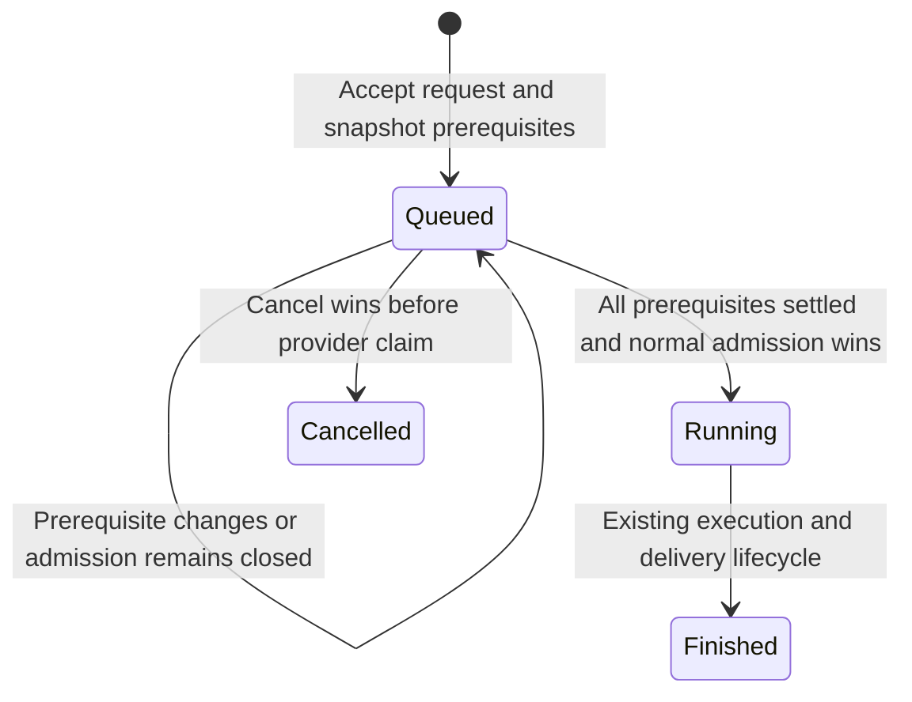

# Wait for existing work

Status: proposed design, not implemented. Updated 2026-09-10 from Tejas's voice captures and thread clarification. The requested experience is an immediately visible request in its destination channel, a waiting emoji, and automatic execution in that same thread only when the request explicitly asks to wait.

The operating profile is Concierge's existing personal, single-operator Slack workspace. This proposal extends its durable turn queue. It adds no service, credential, scheduled job, provider conversation devoted to waiting, or global channel execution lock.

## Existing behavior

A provider session is the underlying agent conversation and its accumulated context. It is distinct from a visible Slack thread and from one execution, which Concierge calls a turn.

| Situation today | What happens |
| --- | --- |
| Two Slack roots resolve to the same provider session | The second accepted request queues behind the first, in admission order. Each response stays in its own Slack thread. |
| Two roots resolve to separate provider sessions | They can execute concurrently. Being in the same channel does not make one wait for the other. |
| A reply arrives in the exact thread of a live turn | It normally steers that execution rather than becoming a later request. |
| The brief deployment restart gate is closed | New requests remain durable and queued until ordinary admission resumes. |

Shared-session channel mode is the main reason different roots share a queue. Explicit fork/comparison isolation remains independent. Queue promotion also respects earlier parked requests, provider retry eligibility, and pending artifact delivery. These are existing admission rules, not the proposed feature.

Confirmed against source at `a603001`: [`routing.ts:16`](../../bot/src/routing.ts#L16), [`index.ts:2346`](../../bot/src/index.ts#L2346), [`index.ts:2506`](../../bot/src/index.ts#L2506), [`state.ts:4165`](../../bot/src/state.ts#L4165), [`state.ts:4310`](../../bot/src/state.ts#L4310), and [`session-turn-queue.ts:16`](../../bot/src/session-turn-queue.ts#L16). Current contracts: [provider sessions](../architecture/PROVIDER-SESSIONS.md), [input and steering](../architecture/SLACK-INPUT.md), and [turn lifecycle](../architecture/TURN-LIFECYCLE.md).

## The proposed experience

Tejas tells the inbox router:

> After the agents currently working in #slack-concierge finish, audit the testing mechanism.

The router immediately posts that request into `#slack-concierge` as a new root using its normal delivery path. It carries an explicit instruction to defer execution. Concierge accepts the request durably, freezes the work it must wait for, adds ⏳ to the request, and posts one short receipt inside its thread:

> **Waiting for existing work**
>
> I'll start automatically after these 2 requests finish:
> [Sandbox test changes] · [Routing fix]
>
> [Cancel request]

The receipt makes the thread immediately usable. Finishing one prerequisite updates this same receipt. When both finish, Concierge removes ⏳ and starts the normal agent progress in the same thread. No new root, routing turn, user resend, or activation click is needed. If no work remains at acceptance, the request starts through normal admission immediately; it does not manufacture a waiting period.

The emoji provides channel-level visibility. The receipt explains exactly what it means, including any earlier queued or parked requests. Plain-text fallback includes the waiting state and prerequisite names for accessibility. Use ordinary supported [interactive message buttons](https://docs.slack.dev/messaging/creating-interactive-messages) and [message updates](https://docs.slack.dev/reference/methods/chat.update/), already within Concierge's Slack interaction model.

Waiting is opt-in for each request. Channel activity alone never enables it. Normal requests keep existing concurrency and live-thread steering behavior. A request to *design a waiting feature*, a quoted example, or an instruction to run two steps inside one agent task is not authorization to defer that request.

## Expressing the wait

The primary interface is natural language to the inbox router: “after the current agents finish,” “queue this behind the existing work,” or “run this after those two threads.” The router resolves destination and explicit waiting intent together. It never starts the destination agent to explain that the agent should wait.

Use one deterministic destination-side command envelope:

| Input | Meaning |
| --- | --- |
| `!after -- <request>` | Wait for outstanding work already accepted in this channel. |
| `!after <thread-link> [<thread-link> …] -- <request>` | Wait for outstanding work in exactly those threads in this channel. |

The router emits this envelope through its existing posting helper; Tejas can also type it directly. Preserve the original request and attachments. For a file-backed long request, the visible routed message must still carry the envelope so Concierge detects waiting before attachment preparation or provider dispatch. A malformed envelope gets a concise error in the request's thread; it never falls through to immediate execution.

An explicit `!after` is classified before live-thread steering. It creates a distinct queued turn even when posted as a reply to a running thread. Its execution destination remains the thread containing the request; selecting prerequisite links does not move the response or change the provider session. The default wait scope is the channel in both roots and replies, avoiding an implicit scope change based on where text was posted.

Exact links identify selected threads. Vague references such as “those agents” require clarification if the target set is not clear. Historical resume requests continue to use Concierge's sanctioned router search and exact returned root; the waiting feature does not replace that routing contract or permit choosing a recent thread by guesswork. Cross-channel prerequisite sets are outside this proposal.

## What the request waits for

Freeze a finite set of prerequisite **turn IDs** in the same SQLite transaction that accepts the deferred turn. Slack thread identities select the scope, but execution identities define the wait. Threads can be reused indefinitely and do not have a permanent “finished” state.

For channel scope, include earlier accepted unfinished turns in that channel across all provider sessions. For selected-thread scope, include them only under those exact visible Slack roots. Include already queued requests and provider-parked requests, as well as running/delivering work and completed turns with still-pending artifact I/O. This means “behind the existing work” includes its accepted backlog; the receipt explicitly distinguishes working, queued, and needs-attention prerequisites.

The cutoff is Concierge's durable admission order, not wall-clock time, Slack display order, or session recency. A Slack event not yet accepted as a turn is outside the snapshot. Store the selected identities once; duplicate delivery, restart, and later mode changes never select a different set.

Consequences:

- New work arriving afterward does not extend the explicit wait. It can run independently under existing session rules.
- Steering accepted into a captured live turn is part of that turn, so the wait includes it. A later separate turn in the same thread is outside the snapshot.
- Two successive channel-wide `!after` requests naturally line up: the second includes the first if it is still unfinished.
- A deferred head does retain its place in its own provider-session FIFO. Later ordinary requests in that same session cannot bypass it. Other sessions remain independently runnable.
- Parent turns own their subagents and tests. Concierge waits for the parent execution; it does not discover arbitrary background shell processes, CI jobs, or detached agents.

Do not use “the whole channel becomes idle” as the predicate. That moving target could postpone an accepted request indefinitely as unrelated new work arrives. A channel-wide mutex would also change ordinary parallel work beyond the requested scope.

## What counts as finished

“After” is an ordering condition. It does not certify that tests passed or that an agent achieved its requested goal.

| Prerequisite condition | Effect |
| --- | --- |
| Provider still running, including a live approval/input pause | Keep waiting. |
| Queued, retrying, or provider-parked | Keep waiting; display the existing retry/attention reason. Existing retry rules remain the authority. |
| Provider ownership or termination is uncertain after a crash/disconnect | Keep waiting until existing recovery proves the outcome; never infer completion from silence or a missing local process alone. |
| Confirmed normal completion, failure, or cancellation with execution released | Satisfy the execution condition. Pass its actual outcome to the new request. |
| Response or artifact delivery still pending/sending | Keep waiting for that owned delivery to settle. |
| Provider is proven finished but delivery is permanently parked | Allow the wait to finish with an explicit delivery-warning outcome; never claim the missing result was delivered. |

Normal success uses the existing final-response settlement path. Failure notices and terminal projections retain their existing durable delivery/parking policy. A later retry does not retroactively stop an already activated successor or silently replace its captured evidence.

If an agent ends its turn with “I need your input,” that is an ended execution; it is not proof its task succeeded. The successor receives that outcome. If the user says “only do this if the tests pass,” preserve that condition in the task and supply the results so the executing agent can evaluate it. The scheduler does not infer test success from final prose or add a second success-predicate language.

The successor receives a bounded handoff identifying the captured turns, their outcome, exact Slack result links where available, and existing terminal summaries. Missing or ambiguous output is labeled. It does not receive merged hidden provider histories or a recomputed latest-thread summary. Ordinary project/session context still applies. Waiting also makes no claim that a commit has deployed: Concierge deployments remain a separate detached lifecycle, and this feature cannot enqueue a deployment-success wake.

## Activation, cancellation, and Slack ownership

A waiting request is an ordinary ownerless `queued` turn with additional prerequisites. Readiness is derived from their durable state; it is not a second running agent or another persistent lifecycle label.

The existing queue coordinator owns promotion. Its transaction checks the prerequisites alongside session FIFO, artifact ownership, retry eligibility, deployment gate, and process drain, then claims that exact turn once. Both immediate admission and later queue selection must use the same prerequisite rule. A waiting request holds no execution lock, provider process, sandbox lane, or active-turn count.

The responsible settlement/recovery/delivery owners wake that coordinator when their durable transition can release a prerequisite. Startup recovers previous owners before reconsidering waits. Coalescing and compare-and-set claims tolerate repeated wakeups. Waiting introduces no polling interval; the existing queue maintenance safety net remains existing infrastructure.

Cancel acts on the exact waiting request, validates the acting user and thread/turn identity, and atomically changes only an unclaimed queued turn to cancelled. Repeated clicks are harmless. If execution already won the race, the button reports that it has started and points to existing native Stop; a stale Cancel must never stop a different turn or silently claim cancellation succeeded. There is no “run anyway” bypass in this proposal. Cancel and resubmit to change a wait condition or accepted task; message edits do not silently rewrite accepted input. Replies before activation follow ordinary session FIFO as separate follow-ups.

The waiting receipt and ⏳ are durable projections owned by that turn, not by the router's provider session. Persist their desired revisions and Slack identities before side effects, extending the existing projection and reaction ownership rather than using fire-and-forget calls. While queued, updates change one receipt without notifying on every prerequisite transition. Once claimed, the receipt becomes a static “Started” breadcrumb and loses its Cancel action; normal progress owns live status. On cancellation it reads “Cancelled” and ⏳ is removed. Serialized projection writes must prevent a delayed waiting update or emoji add from overwriting started/cancelled state, including after restart. A Slack write failure never authorizes duplicate execution.

## Minimum implementation shape

Extend current owners: input classification for the explicit envelope, SQLite admission/selection for prerequisites, the existing queue for activation, provider-input preparation for the terminal handoff, and durable Slack projections for waiting/cancellation. Keep the inbox routing instruction and long-request helper envelope consistent with that parser. Update command hints when implementing the command.

Persist a small wait-selection descriptor on the existing turn and a relation of `(dependent_turn_id, prerequisite_turn_id)` with a unique pair and reverse lookup index. Both IDs refer to existing turns. Only earlier turn IDs may be prerequisites. Together with ascending session FIFO, this excludes cycles without a general DAG scheduler, traversal service, or configurable workflow engine. Retain referenced prerequisite evidence while a waiter needs it; missing evidence fails visibly rather than counting as completion.

No copied prompt queue, waiting-provider session, periodic Slack history scans, or alternate dispatch path is needed. Input and attachment metadata remain under the existing durable input claim and normal private preparation path. If a file becomes unavailable before execution, surface the existing preparation failure; do not start with a partial task or promise indefinite external file retention.

The work bounds are explicit:

| Trigger | Work and bound |
| --- | --- |
| One opted-in acceptance | Select its `D` existing prerequisites and store `D` unique edges once; no historical transcript scan. |
| A relevant settlement | Indexed lookup of affected waiting turns, coalesced reevaluation of their finite edge sets, and changed projections only. |
| Startup | One pass over outstanding waits after ordinary owner recovery, proportional to retained waiters and their edges. |
| Idle | Zero new recurring work. No provider tokens spent waiting. |
| Claim or cancellation | Stop waiting projection activity for that request; retained audit evidence follows turn retention. |

For `W` outstanding waiters and `T` retained turns, stored edges are bounded by the explicitly selected older pairs (`sum D`, at most `W × T`); they never grow as new work arrives. This design assumes the observed personal-workspace profile, not a fleet workload. No arbitrary prerequisite cap, cache, or batching subsystem is justified. Implementation should record actual acceptance cardinalities with its sandbox evidence.

## Complete delivery acceptance

Implement this as one coherent feature, including input expression, waiting visibility, cancellation, activation, handoff, recovery, docs, and focused sandbox coverage. No part is activated separately.

Deterministic tests must prove the frozen snapshot, explicit opt-in classification before steering, duplicate-input behavior, older-only edges, no admission bypass, independent-session progress, terminal outcomes, pending delivery, restart recovery, and Cancel-versus-claim races. Include a multi-turn projection regression proving that late waiting updates cannot overwrite active/terminal state or the thread's cumulative summary.

In a claimed four-lane Slack sandbox, run two controlled independent turns in the target channel, route an opted-in third request through the inbox/helper path, and prove: its root and thread exist immediately; ⏳ and exact prerequisite links appear; no destination provider starts early; finishing only one prerequisite leaves it waiting; finishing both starts exactly one execution under the original root. Add a later ordinary request in an independent session and prove it neither waits nor extends the snapshot.

Exercise selected-thread scope, same-thread explicit deferral versus ordinary steering, no-prerequisite admission, file-backed routing, cancellation, provider failure/park, pending delivery, and candidate reload while waiting. Join Slack message identities to durable turn/dependency rows and provider-start evidence. Verify emoji removal and the waiting-to-progress transition in the lane's persistent browser. Use no production reproduction traffic.

The subsequent implementation follows the repository's one fresh-context complete-diff review, correction verification, and final local test gate before push. This design-only change does not claim that proposed behavior has passed Slack acceptance.

## Design evidence

Source inspection focused on the routing, queue admission/promotion, steering, and terminal settlement owners; the large `index.ts` and `state.ts` files were inspected in relevant sections, not read in full. No LSP tool was exposed in this session. Existing focused tests passed: `bun test tests/routing.test.ts tests/session-turn-queue.test.ts tests/queued-turn-execution.test.ts` — 14 tests, 97 assertions. These establish the explanation of today's queue, not the proposed feature.

A brief Readwise check surfaced [Ben Follington's First-class Agents](https://read.readwise.io/read/01kj4ss2b18d70rkxp25f3b8ek), document `01kj4ss2b18d70rkxp25f3b8ek`, as adjacent context for composing work through explicit events. Concierge's existing ownership and queue contracts determine this proposal; it does not adopt that article's polling implementation.
