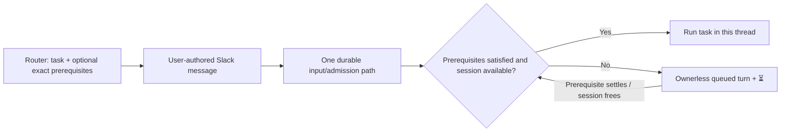

# Wait for existing work

Status: design only, not implemented. Revised 2026-09-10 after Tejas clarified that later requests must not extend a captured wait and rejected changing deferred messages to bot authorship. The agreed direction is one user-message execution path with optional exact prerequisites. This document supersedes the bot-authored publication proposal in commit `ff3e331`.

A routed request appears promptly as the user's message in its destination channel. Its request message carries ⏳ while waiting; work starts automatically in that same thread. Waiting is opt-in across Concierge-managed channels. There is no waiting receipt, Thinking indicator, blocker-update post, or activation announcement.

## Fixed executions, not perpetually busy sessions

Suppose C is submitted while executions A1 and B1 are running. The router selects A1 and B1. If later messages start A2 or B2 in those sessions, C still depends only on A1 and B1.

| Event | Effect on C's explicit prerequisites |
| --- | --- |
| A1 completes; B1 is still running | Wait for B1. |
| A2 starts in A1's former session | No new dependency. |
| B1 completes while A2 continues | Explicit prerequisites are satisfied. |
| B2 starts afterward | Does not re-block C. |

The destination's own provider session still obeys ordinary FIFO and cannot run two conflicting turns at once. That admission constraint is separate from watching A/B's sessions. Work that arrives after C has entered that FIFO cannot overtake C. If C uses an independent session, it can run alongside A2/B2.

Steering acknowledged within A1 is part of A1; a separately accepted later request is a different execution. The router resolves exact existing work rather than selecting “whatever is newest in this session” at each check.

## Responsibilities

| Component | Responsibility |
| --- | --- |
| Inbox router | Interpret destination, new/resumed work, and explicit waiting intent; resolve described agents/sessions to exact executions using authoritative lookup; submit the task and those direct prerequisites. |
| Concierge service | Validate identities, bind routing information to the exact Slack input, durably admit it, enforce prerequisites and session ownership, and project Slack state. It makes no second natural-language decision. |
| Destination task agent | Begin the actual task only after admission permits execution. No agent is launched to monitor waiting. |

The work lookup returns exact execution IDs, channel/root/session evidence, current state, request/title evidence, and Slack links. It reports completeness and distinguishes an empty current-work snapshot from unresolved identity. “These two agents” means the union of the two resolved selections, including selections from different channels. A provider name alone is not a unique agent identity.

Use sanctioned historical thread search when needed to identify the described work, followed by exact execution lookup. Preserve its source-message cutoff and clarification rules. A completed source can be a satisfied dependency without being resumable; resuming the destination still requires proven resumability. Never guess by recency or silently omit an unresolved prerequisite.

The selected IDs are frozen at lookup. If they finish before submission, their conditions are satisfied. The service validates and stores the selected set; it does not replace them with new work. Missing or mismatched references cause an explicit error. A complete empty selection is an explicit instruction with nothing to wait for.

The router supplies direct edges: C depends on A1 and B1. If A1 itself waits for X, its existing dependency supplies the transitive ordering. No copied full graph is needed. Direct channel prose retains its existing interpretation; this feature does not introduce another classifier.

## One message and execution path

Extend the existing router `post`/`resume` operations with optional exact dependency data. Keep the user token and existing text/file presentation. Ordinary and deferred routed requests use the same operation and the same user-message intake. The transport must not create a synthetic provider turn or reserve a fabricated Slack root.

Conceptually, the router supplies:

```json
{
  "action_id": "stable-source-action-id",
  "destination": {"channel_id": "C_PRODUCT", "root_ts": null},
  "task": "Audit the testing mechanism.",
  "defer": true,
  "depends_on": [
    {"turn_id": 410, "channel_id": "C_SOURCE_A", "root_ts": "1789000000.000001"},
    {"turn_id": 417, "channel_id": "C_SOURCE_B", "root_ts": "1789000010.000002"}
  ],
  "source": {"channel_id": "D_INBOX", "message_ts": "1789059185.484779"}
}
```

These identifiers are illustrative. Real execution references come from the lookup. A resolved root replaces `null` for a resume. An ordinary routed request has an empty dependency list. An explicit deferral remains a separate task even if its selected dependencies have already completed; retain that routing decision separately from list emptiness so it cannot accidentally become steering.

The normal flow is:



No dependency relation is inferred from the visible task text or emoji. The router understands language once; service code checks exact ledger references.

## Binding the router's instruction before execution

The remaining transport obligation is precise:

> A Slack input cannot be classified as having no dependencies while its routing information is still being attached.

Posting and then making an unrelated “set dependencies” call without this protection is unsafe: the message event can arrive between them. Changing the Slack author does not solve an admission-ownership problem and is not part of this design.

The recommended implementation puts routed publication and its binding under the existing Concierge process. Both ordinary and deferred `post`/`resume` operations call that same posting owner through a private local socket; it uses the current user token. This changes internal ownership uniformly, not who authored the message or how an execution starts. Bun supplies the socket transport directly ([documentation](https://bun.sh/docs/runtime/http/server#unix-domain-sockets)); no additional daemon, public endpoint, credential, or queue broker is needed.

1. **Register before posting.** Persist a routing delivery record containing the stable source/action identity, target, immutable task/files, explicit-deferral decision, and exact dependencies. This is posting/admission evidence, not a second execution queue. Validate source authority and references before the Slack write.
2. **Post as the user.** Use the existing text or file-upload flow. Persist the posting attempt and reserved file identities before the corresponding side effect.
3. **Bind the exact receipt.** Record the returned channel/message/root, or the exact share proven through reserved file IDs, against the delivery record. Commit that binding before permitting this input's execution decision.
4. **Admit normally.** The Slack input passes through the existing durable claim and session-routing path. Attach its registered prerequisites in the same transaction that creates its ordinary queued turn. Then apply the common start predicate.

The publishing owner must protect the write/receipt interval. Before steering, capture, or provider admission, a potentially matching incoming input checks outstanding publication records for its workspace, channel, posting user, and known destination root. If its exact binding is not yet known, preserve the input durably and defer classification. On binding or proven non-delivery, release affected inputs: the exact routed message gets its registered dependencies, and unrelated inputs continue normally.

This protection lasts for unresolved message publication, not for A1/B1's execution duration. It does not close provider admission for the channel, interrupt running work, or postpone inputs whose identity rules out the pending publication. Successful binding and publication recovery are the release events; no delay-based assumption or model judgment is involved.

There is a real tradeoff: if a text post's outcome remains ambiguous and the received events cannot identify it exactly, potentially matching inputs can remain held. They cannot safely be called independent merely because the API call timed out. Expose that precise failure through existing error/on-demand inspection mechanisms; never turn an unresolved binding into an empty dependency list. Exact request correlation carried by Slack can narrow this uncertainty, but it must be proven for the actual posting path before relying on it.

Text API receipts and file-share IDs establish normal binding. Existing user-token text and upload paths are confirmed in [router posting](https://github.com/tejasdc/slack-concierge/blob/ff3e331/bot/scripts/router-post.ts#L165). Native Slack metadata is an optional correlation candidate, not the chosen authority: the [metadata guide](https://docs.slack.dev/messaging/message-metadata/) does not by itself prove user-token behavior on every path, and [upload completion](https://docs.slack.dev/reference/methods/files.completeUploadExternal/) documents no metadata argument. Do not assume every event includes a client-generated ID.

Idempotency uses runtime realm plus exact source message plus stable split-action ID. Identical retries return the existing delivery/input; conflicting payloads under the same key fail. A helper disconnect does not abandon accepted service-owned publication. Files are copied into durable request-owned storage before accepted handoff so caller cleanup cannot break publication; once Slack delivery and input ownership are established, the existing attachment lifecycle takes over. Ambiguous writes are never blindly repeated.

## Where the code checks

The inspected source already provides the right execution shape:

- [Input handling](https://github.com/tejasdc/slack-concierge/blob/ff3e331/bot/src/index.ts#L2286) durably claims the Slack input. Dependency-binding resolution must precede [live steering](https://github.com/tejasdc/slack-concierge/blob/ff3e331/bot/src/index.ts#L2350), so an explicitly deferred request cannot be injected into a running turn.
- [Initial admission](https://github.com/tejasdc/slack-concierge/blob/ff3e331/bot/src/state.ts#L4166) inserts an ordinary queued turn before attempting provider ownership. Attach the prerequisites and check eligibility there.
- [Queued promotion](https://github.com/tejasdc/slack-concierge/blob/ff3e331/bot/src/state.ts#L4311) checks session FIFO, active turns, artifacts, and admission gates. Apply the same prerequisite rule before its ownership transition.
- The [existing queue coordinator](https://github.com/tejasdc/slack-concierge/blob/ff3e331/bot/src/session-turn-queue.ts#L16) wakes and runs eligible claims. Prerequisite settlement wakes this owner; there is no separate deferred-task dispatcher.

```text
can_start =
  input and routing information are resolved
  AND turn is queued
  AND every captured prerequisite has settled
  AND the destination session's existing admission rules permit execution
```

Waiting is the existing ownerless queued state plus a unique `(dependent_turn_id, prerequisite_turn_id)` relation. Index the reverse relation to find affected waiters. Validate older-only prerequisites when creating a turn; combined with ordinary ascending FIFO, this prevents cycles. Keep capture, duplicate handling, explicit deferral, and ordinary steering decisions within the shared intake policy.

A current-work snapshot includes accepted queued/running/delivering work, provider-parked work, and unresolved owned artifacts in its explicit scope. Pending routing publications must be reported as unresolved lookup evidence rather than silently excluded from a supposedly complete snapshot; resolve or clarify before selecting exact execution IDs. Work arriving after the lookup does not enlarge the chosen set.

“Settled” means a proven terminal execution outcome and settled or explicitly parked owned delivery. Confirmed failure or cancellation satisfies ordering while preserving that actual outcome. Provider retry, ambiguous provider ownership, and provider-parked work remain unfinished. An answer asking for input ends that execution without proving task success. Conditions such as “only if tests pass” remain task requirements, with prerequisite outcome evidence supplied when the task begins.

Dependencies refer to managed turns, including the tests/subagents those turns own. They do not discover detached processes or wait for deployment success.

## Restart and Slack behavior

The database preserves the exact input, dependency edges, publication/binding evidence, and provider ownership. Events wake owners; emoji only project state.

| Interruption | Recovery |
| --- | --- |
| Router disconnects after accepted posting handoff | The service retains the posting intent; retrying the same source/action retrieves it. |
| Slack event arrives before the receipt binding | Keep the input pending until exact binding or proven non-delivery resolves classification. |
| Service restarts during unresolved publication | Recover the dead publishing owner and saved inputs. Reconcile exact receipts/shares; park ambiguous outcomes without executing or blindly reposting. |
| Service restarts while a turn waits | Reload the original prerequisites. Do not reinterpret the text or select new work from the source sessions. |
| Completion commits but its queue wake is lost | Startup rechecks durable prerequisite outcomes after ownership recovery. |
| Provider may still be alive | Use existing provider/process admission recovery; process exit alone does not authorize a duplicate launch. |
| A reaction update is lost or arrives late | The existing durable projection converges to the turn's current state; it does not control execution. |

⏳ appears on the user's request: the root for a new thread, or the request reply for a resume. A healthy wait produces no additional reply, activity clock, or Thinking state. On successful claim, clear ⏳ and begin normal task progress in that thread. Keep the existing user-authored root and cumulative-summary writer.

Ordinary replies to a waiting new thread follow its session FIFO; after activation, normal live steering remains. An explicitly deferred resume queues its task even if the root already contains active work. Existing ordinary steering is not reclassified as a dependency instruction.

Inspection and cancellation can be explicit, on-demand controls using exact turn ownership. A cancellation races atomically with the queue claim; after activation use native Stop. Removing ⏳ is not a command.

Healthy waiting adds no polling, watcher agent, timer, or recurring Slack history scan. Registration costs one delivery record and its finite input/files. Admission stores D selected edges; settlement checks affected waiters; startup examines outstanding state. Files follow existing cleanup after ownership handoff; keep the delivery receipt with its source/input deduplication evidence and retain dependency evidence while referenced. Waiting projection work ends on claim/cancellation. An unresolved publication is parked for exact recovery instead of spawning an indefinite retry loop.

## Whole-change acceptance

Implement no runtime changes from this design discussion. The eventual whole feature includes user-token router publication/binding, exact dependency lookup and submission guidance, shared admission/promotion, quiet Slack projection, and recovery. Product repositories need no scheduler or new classifier. Update the shared service/helper docs and the inbox router's instruction owner in that delivery.

Acceptance in the four-lane Slack sandbox must prove:

- A user-authored request in channel C waits for exact executions A1/B1 from different channels, shows only ⏳, and starts once in the same thread after those executions settle.
- A2/B2 arriving in the source sessions do not extend or reintroduce C's dependency wait. A separate case preserves destination-session FIFO.
- Ordinary and deferred routed messages have the same author, root/file presentation, input-claim identity, and provider dispatch path.
- Named references, ambiguity, empty selections, completed references, completion between lookup and post, chains, and mismatched identifiers behave as specified.
- Text, audio/files, and long requests retain their exact input and attachments; early Slack events and duplicate events cannot bypass dependencies.
- Inputs racing publication wait for exact binding; unrelated inputs are released correctly, and potentially matching inputs with an ambiguous receipt never fall through as dependency-free.
- Explicit deferred resumes cannot steer a running task; ordinary steering remains intact.
- Helper disconnection, publication interruption, service restart, lost settlement wake, and provider-admission interruption recover without reconstructing intent or duplicating execution.
- No receipt/activation post is generated; reaction and cumulative-summary projections remain correct across later turns.

Use focused regressions, exact-source Slack sandbox evidence, the repository's one fresh-context whole-diff review, corrections, and the final local gate. This revision is documentation only; no Slack write or runtime test establishes the proposed transport yet.

## Evidence limits

Source inspection used targeted sections and verification searches; large files were not read in full and no LSP tool was exposed. Earlier routing/queue tests passed 14 tests and 97 assertions against the previously inspected source; those results establish existing behavior, not this feature. Documentation checks validate links, stale-design references, and the diff.

The earlier Readwise/skill discovery context remains adjacent background only. The authority for this design is the user's corrections, the existing Concierge lifecycle, and the cited primary Slack/Bun contracts.
