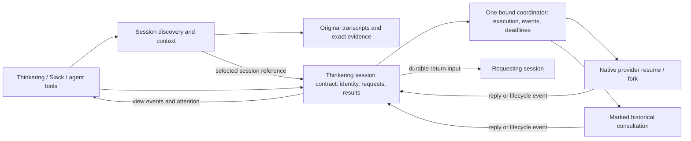

# Durable session communication and historical consultation

Status: **proposed; awaiting Tejas's approval.** This supersedes the scope recommendation in the [September 11 observation-led proposal](2026-09-11-agent-communication.md). It authorizes no runtime changes. Source: [Tejas's September 14 requirements](https://tejazz.slack.com/archives/C0BNN5K4JSJ/p1789430041369759?thread_ts=1789154481.755879&cid=C0BNN5K4JSJ).

## The product

An agent should be able to find a conversation that knows something relevant, ask it a question, continue other work or end its turn, and receive an answer or a clear problem later. The recipient can be running, idle, stopped by accident, or represented only by an imported historical conversation. Thinkering is the primary management surface; Slack is one adapter.

The durable entity is a **session with a particular history and branch**. A process is an execution attempt. A provider's thread identifier is a binding. A Slack thread or Thinkering view is a surface. None of these interchangeable-looking identifiers should stand in for the others.

The September 11 exchange remains useful evidence: 29 peer replies included 25 acknowledged steering inputs and four idle-session resumes, supporting contract negotiation, sandbox ownership handoff, and final evidence. Two no-action FYIs unnecessarily woke the finished host. The small reply-helper proposal covered that exchange but did not cover discovery, portable history, or guaranteed return after failure. Those are now required.

## Requirements carried into this revision

1. Discover relevant sessions from requirements, prior decisions, subject matter, and history; agents need not know a channel, provider ID, or active process.
2. Keep useful back-to-back conversation while making result-bearing requests asynchronous by default.
3. Resume the requester automatically on useful replies, completion, failure, or a problem needing its decision. Ending the requester's turn does not cancel its outstanding requests.
4. Hide provider start/resume/steer decisions below the addressed-session interface.
5. Support conversations imported from Mac Claude Code and Codex archives, and future ChatGPT exports, with explicit provenance and fidelity.
6. Distinguish recovering an accidentally dead execution from continuing a deliberately stopped one.
7. Add durable deadline checks, around the proposed 30–60 minute interval, so unresolved work never disappears into an indefinite silent wait.
8. Let callers optionally observe synchronously, stream status, or poll without making those mechanisms the durability owner.
9. Consult experienced historical sessions for informed reviews and contrasting opinions.
10. Preserve branch identity, exact evidence, authorization, and one execution owner when sessions span machines or surfaces.
11. Compose with the transcript-search project and Thinkering session-management design. Do not create another full-transcript store or search engine inside Concierge.
12. Use existing protocols and harnesses where their actual contracts help; compare them with native provider integration instead of assuming a custom harness restores more information.

## Ownership and architecture

For this personal, single-operator system, Thinkering owns the canonical `AgentSession` catalogue and transport-neutral interaction contract. One session coordinator owns ordered admission, return obligations, and recovery for each exact session. Native provider runtimes retain execution and transcript ownership. Concierge's current orchestration can implement that runtime port for its existing sessions; Concierge's Slack transport becomes an adapter over the same contract. These are responsibility boundaries, not a requirement for a new daemon or a wholesale runtime replacement.

| Owner | Responsibility |
| --- | --- |
| Transcript archive / remote-box | Retain provider records through the existing sanctioned transport; own frozen import snapshots and host/environment integration. |
| Thinkering core | Canonical session identity and lineage, catalogue, project/intent links, archive state, attention generations, and the interaction contract. |
| Session-search project | Supply the rebuildable dialogue retrieval index behind Thinkering discovery, exact evidence, coverage, and truncation. The current three-source router index is not the full solution. |
| Bound session coordinator | Ordered request acceptance, result obligations, exact runtime binding, scheduling, recovery, deadlines, and durable events for the session it owns. |
| Native provider adapters / import adapter | Resume or fork supported histories; construct an explicitly identified consultation child when native continuity is unavailable. |
| Thinkering UI | Discovery and session views, attention, review branches, controls, history presentation, and communication status. |
| Slack adapter | Map existing visible roots and exact input identity to session commands; project relevant events without making Slack publication a prerequisite for internal work. |

Thinkering's existing authenticated backend accepts user commands and invokes the bound runtime port. Same-host adapters use a private local boundary; an offline remote adapter is an explicit capability state. Browser clients do not receive provider sockets or Slack credentials; capture-ingress credentials are not an authorization shortcut for session control. Commands are scoped to the acting user, exact session, and permitted effect. Choosing a local socket versus an existing in-process port is an implementation detail; creating a new public control endpoint is not part of this proposal.

Each runtime binding names exactly one current coordinator. A handoff fences the prior owner before a successor may accept work; a UI change cannot create a second Codex/Claude scheduler. Thinkering's catalogue and the runtime's execution records describe different facts, not competing session identities. Raw historical transcripts remain in their archive/provider authority; the communication service stores its own exchanged messages, request state, result artifacts, and exact references.

This incorporates the [session-management owner's consultation](https://github.com/tejasdc/slack-concierge/blob/e38513e/docs/brainstorms/2026-09-14-thinkering-first-agent-session-interface.md). One clarification follows Tejas's current requirement: an ordinary question records automatic return-and-wake intent by default. The requester need not also issue a separate wait command. A deliberately one-way message or suspended/archived requester can retain information without an automatic provider wake.



## Discovery, then contact

Searching and contacting are separate operations, with a small shared identity contract:

```text
sessions.search(query, filters?) -> candidates + coverage
sessions.context(candidate_ref) -> exact dialogue evidence + lineage + capabilities
sessions.ask(session_ref, message, intent, evidence_refs?) -> request_ref
sessions.reply(request_ref, content, final?) -> receipt
requests.get(request_ref) -> state + events + result
requests.cancel(request_ref) -> cancellation disposition
```

These are proposed semantic operations, not commands already installed. The default `ask` returns promptly after durable acceptance. Its authenticated caller/source is derived by the service, not asserted in message text.

Search results need title/topic/date, source provider and host, the matching user/assistant passages, exact source revision and branch, visibility, and contact capabilities. Coverage distinguishes absent matches from unavailable sources, stale indexing, omitted modalities, and truncated evidence. Ranking is evidence for selection, not proof of identity. An ambiguous result remains a choice to resolve with additional context or Tejas.

The search owner's contract narrows the corpus to genuine user/assistant dialogue: voice transcripts, follow-ups, commentary, full answers, and surfaced artifact references. System prompts, tool logs, hidden reasoning, router wrappers, and duplicate summary copies do not compete in discovery ranking. Context returns the matching passage, neighboring dialogue, original goal, relevant later outcome, and omissions. An agent should be able to explain why the candidate knows something relevant before contacting it. Exact tool or artifact evidence remains separately readable when the task calls for it.

CASS is the leading reusable search candidate, conditional on index-only/dialogue-only operation and exact source locators. Unmodified CASS makes raw source copies and is not the approved integration. Keep it behind the replaceable search interface; a broad fork would defeat the reason to reuse it. Neither CASS nor the current router FTS owns identity, capability, or branch selection. The [search owner's consultation](https://github.com/tejasdc/slack-concierge/blob/4da43a694636bf4b780d9fa49c3094e98bbc45a0/docs/brainstorms/2026-09-14-agent-session-discovery-ownership.md) contains the current corpus evidence and backend conditions.

After selection, `session_ref` is the opaque, stable `AgentSession.id` for one exact branch. The caller does not send a Slack root, guess whether a process is alive, or choose a provider resume verb. A search hit on an imported archive can be discoverable while its contact capability is “reconstruction available” rather than “native resume available.”

Intent describes the work, not lifecycle plumbing:

- **Collaborate:** ask the owning conversation to coordinate current work. The runtime steers its compatible active execution or admits a new turn through the same session queue.
- **Consult/review:** ask for an opinion grounded in a selected history. Default to an isolated child at an exact history boundary so reviewing does not redirect an active implementation or overwrite the original conversation. Prefer a native fork when supported; otherwise create a marked reconstruction.

A follow-up can address the returned consultation child directly. Creating a child must not silently redirect future messages addressed to its source. The API returns the actual responding session, source checkpoint, and fidelity so callers can assess its opinion.

The underlying addressed envelope also carries service-issued source input identity, a stable source action, requested effect (`consult`, `propose`, or `mutate`), reply correlation, and any exact dependency set. Intent and effect are distinct: collaboration can merely propose a contract; a request for mutation still needs existing authority. One source-input/action pair cannot name two requests. Thinkering admits its own authenticated source event; it never manufactures a Slack timestamp to use this API.

## Identity and evidence

| Identity | Meaning |
| --- | --- |
| Session reference | Stable logical conversation/branch in the catalogue. Independent of title, cwd, process, and UI. |
| Source reference | Provider/export namespace, original source ID, selected branch/checkpoint, immutable source revision/hash, and evidence location. |
| Runtime binding | Provider, native thread/session ID, host, execution environment, and current owning attempt. |
| Surface binding | An exact Thinkering view or Slack channel/root mapped to the logical session. |
| Request reference | One accepted question/work item, caller, target, source event, return destination, and stable idempotency key. |
| Event/result reference | Immutable, correlated output with sequence and source evidence; not “the latest reply.” |

Copies of the same archive must not become independent apparent experts. Different branches, resets, and later revisions must not be flattened together either. Re-import is idempotent for the same source snapshot; a later snapshot adds a revision rather than mutating evidence already cited by a request.

Use native identity within an account/profile namespace to join proven replicas. A transcript hash identifies a snapshot, not the logical session: the same session grows over time. When native identity is absent, retain a catalogue ID plus import-manifest alias; leave uncertain duplicates separate. Evidence uses an exact event/record locator, role, order, and content hash under the selected revision. A file move can resolve through a verified replica; unavailable evidence cannot be replaced with similar text from another session. Archive transport may update existing files, so freeze content-addressed import snapshots before consultation.

Binding and capability validation happen again at admission. A missing, changed, inaccessible, or ambiguous binding cannot fall back to a newest session. Imported prose never supplies current tool permission. Peer messages retain explicit agent origin even when a Slack presentation uses Tejas's user token.

## Request, reply, and return lifecycle

1. **Accept atomically.** Persist the request, immutable selected target/history, message content/references, and its default return obligation together. A fast reply cannot outrun subscription creation. Payload conflicts under the same idempotency key fail.
2. **Resolve execution.** The session owner chooses safe steering, FIFO admission, reconnect/resume, native fork, or an imported consultation according to intent and capabilities. Bind the exact input acknowledgement and execution attempt. Provider admission, acknowledgement, and completed work remain distinct.
3. **Exchange substantive replies.** Contract proposals, clarifications, evidence, and requested milestones can return before final completion. A correlated reply updates the existing request; it does not automatically create a reciprocal question.
4. **Complete explicitly.** A request-specific final reply stores the answer/result and final disposition. In a child dedicated to one consultation, its final output is already bound to that exact request and the adapter can collect it without a messaging tool. A turn containing several steered questions needs explicit request correlation; whole-turn completion cannot declare all of them answered. If it ends without a correlated final, the service returns an “ended without a confirmed answer” event and retained output references, rather than silently dropping the request or inventing success.
5. **Deliver to the requester.** Store the result and its notification intent before any wake. An active compatible requester receives ordered input; an idle requester gets a new turn in the same logical session. A result arriving during the end-of-turn boundary lands in the same durable mailbox and cannot be lost.
6. **Acknowledge consumption.** Service acceptance, provider acknowledgement, and response consumption are separately recorded. Use one event identity across retries, and recover pending delivery after a proven dead owner. Ambiguous acknowledgement is parked and surfaced, never blindly replayed.

Atomic acceptance is local to the owning coordinator, not a transaction spanning two providers. The sender records outbound intent plus return obligation first; the target records the same stable request once; receipts connect their ordered streams. Result delivery follows the reverse path. A unique event is the deduplication boundary, not a claim of exactly-once network delivery or model execution. Replaying history rebuilds projections; it never invokes a provider again.

The sender's coordinator owns the request's deadline and return obligation; the target's coordinator owns admission and execution facts. Their records join by request identity. A failed Slack projection cannot block an internal reply or change a confirmed result. Durable cursors let Thinkering reconnect without replaying model effects; transient typing/progress does not advance those cursors.

The return envelope includes the request, responding session, reply relationship, typed outcome, useful result text, exact evidence references, history/fidelity boundary, and any required next decision. Normal completion does not require the requester to read a Slack thread first.

One-way messages can explicitly decline a result obligation. Ordinary questions default to expecting a response. Automatic status events and replies never subscribe to themselves or trigger acknowledgement loops.

## Asynchronous waiting, dependencies, and observation

The caller can continue independent work or yield/end. No provider process needs to remain alive to remember a pending request. The durable request owns the wait.

A synchronous wait is only a bounded observation of that same request. A timeout or disconnected stream leaves the underlying request and its return obligation intact. Polling is also an explicit observation mode; it must not create another task, retry an uncertain send, or become the default model loop.

Existing `work/--after` remains for ordering against exact older executions. Its older-than-source restriction and fixed dependency set remain intact. Do not encode a newly issued question as an old turn dependency or fabricate a newer source timestamp. Session requests compose above that queue: a reply/completion event later becomes ordinary session input, or an explicitly declared continuation is released on the chosen request outcome.

Do not insert a blocked waiting provider turn at the head of a session FIFO when the reply needed to unblock it must enter behind it. Waiting belongs to the request record; unrelated and incoming work can run. For explicit “all answers” continuations, persist the finite request set and outcome policy; failures must wake a decision instead of being mistaken for successful prerequisites.

Slack's current steering lookup is by exact visible root. New session-native input must route through the logical session owner; it must not choose a Slack root by recency. Existing Slack reply behavior and fork/comparison isolation must remain explicit during this normalization.

The coordinator supplies and revalidates an exact current interaction reference before live steering. A Slack reply retains its selected root; a Thinkering view or session-native collaboration request resolves through the addressed branch's current coordinator. Stale, absent, or incompatible interaction evidence means ordinary FIFO admission. This keeps lifecycle mechanics below the API without treating an opaque session ID as permission to interrupt arbitrary work.

## Failure, deadlines, and recovery

A stopped process is not necessarily a stopped session, and no visible output is not proof of a dead process. Prefer provider lifecycle events and owned process identity. Time checks are the safety net when those events do not settle the request.

Proposed default policy, configurable by request intent:

| Condition | Service action |
| --- | --- |
| Recipient is busy and healthy | Queue or steer according to ownership; do not start a duplicate execution. |
| Connection lost but native thread is alive | Reconnect to that exact thread and reconcile acknowledged input. |
| Execution accidentally died, exact state is recoverable | Prove its owner dead, claim one recovery attempt, resume from a safe acknowledged boundary under the same request, and record the new attempt. |
| Historical tools may have run but their outcome is uncertain | Do not replay them. Return uncertainty and the evidence needed for a decision. |
| Intentional Stop/cancel, missing approval, or explicit suspension | Respect the stop. Notify the requester; a timer cannot create authorization to restart. |
| No answer by 30 minutes | Perform one bounded inspection of that exact request/binding. Recover if safely possible; otherwise report the problem. A healthy or successfully recovered execution gets a recorded extension to 60 minutes. |
| Still unanswered at 60 minutes, or recovery fails | Wake the requester with current evidence and an attention-needed event. Do not silently extend indefinitely. Further extension is an explicit requester/operator decision. |
| A late valid answer arrives | Preserve it under the same request and notify the requester with its late status. Deadline expiry never means the target's work was undone. |
| Requester was normally idle | Resume it to consume the event. |
| Requester was deliberately suspended or its binding is unavailable | Retain the result and show attention in Thinkering; do not silently choose another session or override the suspension. |

Thirty and sixty minutes run from durable request acceptance and are proposed attention policy, not liveness proofs or universal execution limits. Interim progress does not silently reset them. Deadline notification does not automatically kill a healthy target. One recorded recovery attempt per failure episode prevents crash/restart loops; subsequent failure asks for a decision rather than consuming unlimited work.

The service persists due times and arms the next due timer. Restart processes overdue unresolved requests and re-arms that timer. This uses the existing runtime's workflow ownership, not cron, an agent sleep loop, or a new fleet poller. Each trigger inspects one due request and its current attempt. Growth is proportional to unresolved requests; a due-time index avoids scanning all transcript history. Healthy idle systems with no pending requests do no timer work. After attention is delivered, repeated deadline wakes stop until an explicit extension; later real lifecycle/results can still complete the request.

The guarantee is durable disposition and recoverable delivery, not notification while the whole host is unavailable. An outage preserves the obligation and makes overdue checks immediate on recovery; Thinkering shows the last known runtime availability instead of pretending the deadline check ran.

Cancellation is scoped: cancelling a consultation can stop its owned child; cancelling one question delivered into a shared active peer must not kill unrelated work in that peer's turn. Returning a cancelled status and ignoring further automatic wake obligations are separate from proving all external effects were cancelled.

Thinkering's controls preserve this distinction: Stop targets an exact run; Done dismisses the current attention generation; Archive is a sticky, reversible state of one branch. New meaningful results create a new attention generation after Done. An archived session retains incoming requests/results but does not start automatically until restored. Archive cannot silently cancel an active run; a combined Stop-and-archive action reports the two outcomes separately. Slack deletion affects its projection only.

## Conversation and write guardrails

- **No automatic reply-to-reply loop.** A reply belongs to an existing request. Only a new substantive question creates another return obligation. Progress, acknowledgements, and unsolicited FYIs do not wake a finished peer by default; this directly addresses the two observed host wakes.
- **No ambient thread subscriptions.** A request watches its own interaction and selected milestones, not every future event in a conversation. Later unrelated work cannot extend its dependencies or resurrect its deadline.
- **Preserve authority provenance.** The coordinator derives sender identity and carries it through input, results, and projections. Peer prose, imported instructions, and a Slack user-token presentation cannot become new human approval. Requested effect is checked against current authorization.
- **Separate session ownership from resource ownership.** One coordinator orders provider work, while each agent retains its own worktree. Cross-project requests go to that project's owner; they do not grant writes into the peer's checkout. A shared sandbox has one release owner and an explicit consumer handoff.
- **Prevent mechanical cycles.** Deduplicate request/event identity and reject an explicit dependency cycle before admission. A waiting request does not occupy the provider FIFO. A model can still choose several unnecessary new questions; attention, deadlines, cancellation, and native Stop remain available without inventing an autonomous conversation quota.

## Historical session reconstruction

The portable asset is recorded context and its provenance. Native formats may preserve roles, tool interactions, branches, and compaction/checkpoints that a plain transcript loses. No export promises identical hidden state, external files, credentials, model behavior, or unavailable product instructions.

The [resurrection investigation](https://github.com/tejasdc/slack-concierge/blob/8904e116c2a9431461a9653850b767090954ce6b/docs/plans/2026-09-14-historical-session-consultation.md) inspected native documentation, installed schemas, OpenClaw source, and archive metadata. Its inventory found 12,015 JSONL files, not that many unique sessions; its 24-file sample is format evidence, not a full-corpus compatibility test. No historical session was executed. The admission contract is:

- Keep originals immutable and identify the exact branch, snapshot, and source records.
- Prefer the original provider's supported resume/fork route when its retained state, ownership, and environment are valid.
- For cross-host material, validate format/version, attachments, paths, repository revision, tools, and prior owner before advertising native continuation. Copying a filename or UUID is insufficient.
- Otherwise create a persistent, explicitly reconstructed consultation with preserved roles/order, available attachments and source references, recorded omissions, and current instructions.
- Plain text in a prompt is a useful lowest-cost reconstruction, not a native resume. A custom harness can improve structure, retrieval, branch handling, and observability; it cannot recover information the export omitted.
- A review consultation is read-only by default and never executes historical tool calls or treats historical approval as a present grant.
- An immutable historical source and its new consultation child have separate identities. All new reasoning is clearly subsequent to the source cutoff.

| Mode | What it preserves | Best use and important limit |
| --- | --- | --- |
| Native child from an exact boundary | Supported provider history, roles, tool records, branch and effective compaction state | Ask a prior working context for its reasoning or review. Highest supported continuity, but current model, permissions, files, and missing assets can differ. |
| Structured reconstruction | Available selected messages as actual model roles, explicit tool conversions, branch/asset references and omissions | Imported ChatGPT or a deliberate change of provider. New context with source lineage; not the original native session. |
| Evidence in a fresh prompt | Selected cited facts and excerpts | Focused questions or a fresh review. Cheapest route, but quoted `assistant:` text is not an assistant-role message and omitted context remains omitted. |

Choose either the context **as last used** (effective compacted state plus retained tail) or an explicit **historical expansion** including older evidence. Expansion can improve the answer while reducing similarity to what the old harness would resume. Never concatenate every JSONL record: sibling branches, subagents, duplicate display events, discarded turns, and replaced histories require source-specific parsing. Oversized input needs disclosed compaction or a narrower selection, not silent tail truncation.

| Source | Supported direction and remaining proof |
| --- | --- |
| Codex | Native `thread/resume` and `thread/fork` support provider continuity. Current documentation and installed 0.153.4 schemas expose fork boundaries; archive-path loading is unstable and the raw `history` field is explicitly reserved for Codex Cloud. Validate old Mac formats, referenced history prefixes, returned child identity, and the active daemon's actual capability before advertising native import. |
| Claude Code | Current SDK documentation supports moving transcript files across hosts and offline forks at a message boundary. This is more capable than Concierge's currently proven Claude fork path; the adapter still needs exact boundary acceptance. Conversation state and file checkpoints are separate, and old archive versions need validation. |
| ChatGPT export | Treat the supplied export as source material for a new consultation. The export has not yet been supplied, and no native ChatGPT-export-to-Codex/Claude continuation contract was established. Inspect its actual branch/role/asset schema; do not promise recovery of memories, custom instructions, GPT configuration, or absent attachments. |

Provider sources: [Codex App Server](https://developers.openai.com/codex/app-server), [Claude session persistence](https://code.claude.com/docs/en/agent-sdk/sessions), [Claude session-browser and offline fork cookbook](https://platform.claude.com/cookbook/claude-agent-sdk-05-building-a-session-browser), and [OpenAI's export transfer guidance](https://help.openai.com/en/articles/9106926-transferring-conversations-from-1-chatgpt-account-to-another-chatgpt-account). The pinned research brief records exact source/schema versions and their limits.

Materialization reads a frozen source snapshot into a separate staging/child store. The archive/import owner holds those bytes; Thinkering and Concierge retain their manifest references, not another raw archive. It supplies current authentication independently, maps runtime paths without rewriting historical prose, and disables inherited goals, hooks, extensions, and write/send tools for consultation. Old instructions remain historical evidence in reconstructed mode; they do not become current system authority. Missing tool results remain unknown, never fabricated or replayed to fill a gap.

Read-only must be enforced by the active tool/runtime policy, not merely requested in a prompt. If a native fork cannot receive the required restriction, it is not eligible for that review route. Fidelity is a set of dimensions, not a marketing score: preserved dialogue/branch, native execution records, compaction state, model/harness version, available attachments, and environment each need their own status. A new harness can preserve more structure than pasted prose while still being less faithful than a valid native continuation.

## Learning from existing protocols and systems

| System | What to reuse conceptually | What it does not settle for us |
| --- | --- | --- |
| [A2A](https://a2a-protocol.org/latest/specification/) | Separate context, task, message, and result artifacts; capability discovery; asynchronous task updates. | Historical-session search, provider checkpoint import, and our stronger durable result-delivery/idempotency contract. |
| [OpenClaw session tools](https://docs.openclaw.ai/concepts/session-tool) | Separate discover/read/send/yield operations and explicit inter-session provenance; a close existing product precedent. | Its exact routing, reply-loop, and announcement policies are not automatically our requirements. |
| [OpenClaw state awareness](https://docs.openclaw.ai/concepts/session-state) | Versioned state changes, coalesced notices, and explicit history gaps. | Awareness is distinct from guaranteed request results; its polling and best-effort signal behavior should not replace transactional completion intent. |
| [ACP session setup](https://agentclientprotocol.com/protocol/v1/session-setup) | Capability-negotiated UI-to-harness session operations. Loading UI history and restoring execution are distinct. | A portable archive format or cross-session request supervisor. |
| [Codex App Server](https://openai.com/index/unlocking-the-codex-harness/) | A proven separation of client UI, durable thread/turn/item history, and native harness execution. | Cross-provider or ChatGPT-export fidelity. |
| [MCP tasks](https://modelcontextprotocol.io/specification/2025-11-25/basic/utilities/tasks) | Task handles and deferred tool results can expose our API to agents. | The experimental task protocol is requester-driven; it does not itself resume our idle requester or own its lifecycle. |
| [Temporal workflows](https://docs.temporal.io/workflow-execution) | Durable event/timer/continuation semantics. | Adopting a workflow cluster does not supply transcript import or provider ownership. Existing SQLite owners are the proposed first home. |

A2A's send idempotency is optional in the specification, and critical information cannot rely on a disconnected message stream being replayed. Our service therefore requires stable operation identity, retained results, and durable return delivery. These are explicit local guarantees, not a claim that adopting A2A alone supplies them. If an A2A adapter is exposed, map final results to task artifacts and test the chosen protocol version; internal API similarity is not interoperability certification.

A generic harness replacement is not required to remove Slack limitations. Thinkering can drive existing native provider adapters through the session service. The concrete choices are:

| Runtime choice | Benefit | Cost and proposed decision |
| --- | --- | --- |
| Existing native adapters | Preserve supported same-provider continuity and reuse proven execution ownership | Default for validated native children; add source-specific import validation rather than claim arbitrary JSONL compatibility. |
| Pi / pi-mono | Documented session trees, message control, compaction, and multiple model providers make structured reconstruction practical | Strong candidate for the reconstruction adapter. It still needs our foreign-format normalizer and read-only policy; its own JSONL import is not a Claude/Codex/ChatGPT decoder. |
| OpenClaw gateway/adoption | Already separates discovery, native bindings, child creation, display history, and session messaging | Reuse these concrete patterns. Replacing the whole coordinator would be a larger ownership migration; running a second one alongside it is unacceptable. Its display mirror and some prompt fallbacks are lossy, so fidelity must be reported per execution. |
| OpenCode / Amplifier | Useful runtimes for their own formats and tool composition | No demonstrated foreign-archive advantage over the above choices; not proposed additions. |

I interpret the voice reference “monopie” as Pi/pi-mono, tentatively. Its advantage over paste is control over structured context and execution, not recovery of missing information. The [Pi session format](https://github.com/earendil-works/pi/blob/f9bcd351dc3cedf989bc5fc0f8aa012db5737df2/packages/coding-agent/docs/session-format.md) and [SDK](https://github.com/earendil-works/pi/blob/f9bcd351dc3cedf989bc5fc0f8aa012db5737df2/packages/coding-agent/docs/sdk.md) are the relevant seams. The proposed delivery uses a controlled reconstruction adapter behind the same session contract; Pi is the preferred substrate if the existing adapters cannot accept role-bearing history through supported APIs. A pasted evidence packet remains an explicit useful mode, never a hidden fidelity downgrade.

## Experienced review sessions

A prior requirements conversation can explain why a constraint exists and what alternatives Tejas rejected. A native fork or marked reconstruction makes that knowledge available without altering the original history. Send the current proposal/diff as a versioned artifact and ask for cited requirements, disagreements, omissions, and new evidence.

Such a reviewer is a contextual second opinion, not automatically an independent one. Two descendants of one conversation can share the same mistaken assumptions. Show shared lineage, choose genuinely different relevant histories when requesting several opinions, and keep a fresh independent check where the existing release policy requires it. The service preserves the identity and evidence; it does not decide that a familiar session's opinion outranks the user's current requirements.

## End-to-end examples

**The original Thinkering integration.** Search for the [ingress-contract](https://tejazz.slack.com/archives/C0BNN5K4JSJ/p1789154174558759) and [app-integration](https://tejazz.slack.com/archives/C0C03E75160/p1789154181368529) conversations, inspect their evidence, and select exact session references. Thinkering asks the ingress owner for the contract; replies negotiate it while both work. A separate addressed request reaches the [host owner](https://tejazz.slack.com/archives/C0BN9EXRB0F/p1789154396035709) for its part. The sandbox owner hands over a run; the consumer returns exact receipt/evidence and releases its use. Each request returns a correlated result. If either process dies, the runtime safely recovers or sends the other session a failure/attention event. Both can end their turns while return obligations remain durable. Published code and acceptance evidence settle the development request; Concierge rollout remains outside this communication wait, under its existing detached owner.

**An old laptop requirements conversation.** Search finds a particular Mac conversation and branch where Tejas set an important constraint. A current agent asks it to review a new proposal. The runtime creates an isolated native fork if validated support exists, otherwise a marked reconstructed consultation. That child reads the current proposal, cites the historical constraint and its date, and returns an opinion. Its new answer and omissions are stored separately from the original export.

**An exported ChatGPT conversation.** Import/catalogue the provided export without pretending it is a Codex checkpoint. Search selects a branch and source records. A reconstructed review session receives the available conversation and references, with absent attachments or hidden product context declared. It returns evidence-grounded advice through the same request protocol and appears in Thinkering with a reconstruction label.

## Approval and acceptance

This is one coherent design scope: discoverable durable sessions; asynchronous request/reply with automatic results, failure handling, and deadlines; native/reconstructed historical consultation; and a Thinkering-first surface contract. Implementation is still awaiting approval. The search and UI projects retain their own ownership; the three consultations are reconciled here around Thinkering's catalogue, exact source/branch identity, and one bound execution coordinator. No new public control service, full transcript database, general workflow engine, or replacement provider harness is proposed.

Acceptance must demonstrate: exact discovered identity; meaningful recall from full replies/voice/imports; active, idle, and end-of-turn requester races; duplicate sends/results; provider death and ambiguous tool effects; deliberate Stop versus recovery; 30/60-minute checks using controlled time; late results; same-session queue deadlock avoidance; cross-surface identity; immutable imported branches; truthful fidelity and missing attachment reporting; contextual review evidence; and no bot-generated reply loops or competing writers.

Historical acceptance additionally proves original hashes unchanged, exact child identity and boundary, effective compaction versus expansion, real model-facing roles, denied writes/sends and disabled inherited goals, and compatibility for the specific old/current format families being offered. ChatGPT import needs an actual user-supplied export fixture before that format can be advertised. The research brief's fuller acceptance matrix is part of this design; a fluent answer alone is not a continuity test.

Runtime acceptance must exercise the actual approved Thinkering/backend boundary and the existing exact-source Slack sandbox regression surface. No production probes, provider resurrection, or deployment checks are part of this design turn.

## Consultation and evidence record

The existing memory/search session, the existing session-management session, and a separate resurrection research session were consulted through admitted Concierge requests in this turn. Their substantive results informed this document. This also exercised the currently available direct reply path again; it does not prove the proposed deadline or completion-obligation mechanism exists.

| Consultation | Durable result |
| --- | --- |
| Session management, original August 20 conversation | [Thinkering-first interface, e38513e](https://github.com/tejasdc/slack-concierge/blob/e38513e/docs/brainstorms/2026-09-14-thinkering-first-agent-session-interface.md) |
| Search/memory, original September 3 conversation | [Discovery and ownership, 4da43a6](https://github.com/tejasdc/slack-concierge/blob/4da43a694636bf4b780d9fa49c3094e98bbc45a0/docs/brainstorms/2026-09-14-agent-session-discovery-ownership.md) |
| Separate historical-resurrection investigation | [Fidelity and harness comparison, 8904e11](https://github.com/tejasdc/slack-concierge/blob/8904e116c2a9431461a9653850b767090954ce6b/docs/plans/2026-09-14-historical-session-consultation.md) and its linked sanitized archive evidence |

Primary protocol sources are linked at their claims above. The parent also read the local OpenClaw session-tool and state-awareness documents at `df9b55315051b17914c29c0d20ac4ae23859e519`, and Thinkering's documented native-runtime boundary. Readwise research supplied prior-thinking leads, including [Mario Zechner's Pi rationale](https://read.readwise.io/read/01kfj91z78ts6k7bp2vfxwn74g), [ACP introduction](https://read.readwise.io/read/01kk61yzy3te3n4g7ybmgavqd5), and [OpenAI App Server](https://read.readwise.io/read/01kqrbgw7rdcn5x159ws6fjq4g); current primary docs and pinned source govern capability claims.

Confidence is high in the ownership and interaction design; native cross-host compatibility and the ChatGPT import schema remain acceptance questions, not established capabilities. Documentation review checks consistency and source support; no runtime tests were run because this change is a proposal only.
